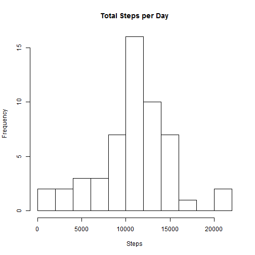
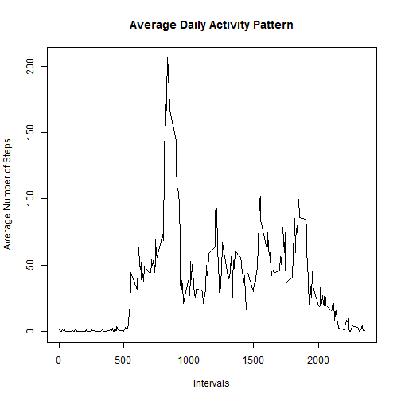
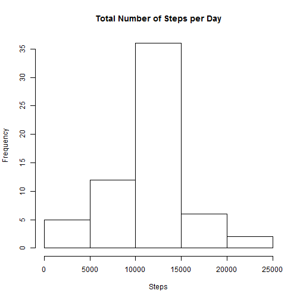
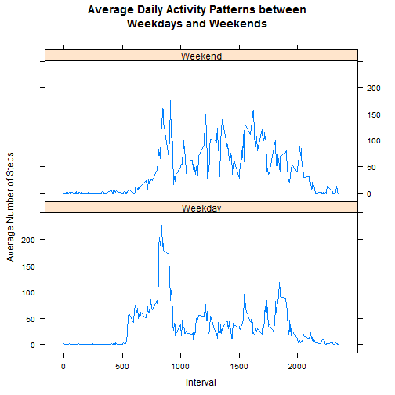

# Reproducible Research: Peer Assessment 1

## Loading and preprocessing the data

Unzip and load raw data file


```r
csvFile <- unzip(zipfile = "repdata-data-activity.zip")

activityRaw <- read.csv(csvFile,as.is=TRUE)
```

Convert date column into date and data into data.table


```r
require(data.table,quietly=TRUE)
```

```
## Warning: package 'data.table' was built under R version 3.1.1
```

```
## data.table 1.9.2  For help type: help("data.table")
```

```r
activity <- data.table(date=as.Date(activityRaw$date), steps=activityRaw$steps, 
                       interval=activityRaw$interval)
```

## What is mean total number of steps taken per day?

Create a histogram of the total number of steps taken each day


```r
totalStepsPerDay <- activity[, sum(steps), by=date]

hist(totalStepsPerDay$V1, main = "Total Number of Steps per Day", xlab = "Steps")
```

 

Calculate the mean and median total number of steps taken per day


```r
totalStepsPerDay_mean <- mean(totalStepsPerDay$V1, na.rm = TRUE)

totalStepsPerDay_median <- median(totalStepsPerDay$V1, na.rm = TRUE)
```

The mean total number of steps taken per day: 10766

The median total number of steps taken per day: 10765

## What is the average daily activity pattern?

Make a time series plot of the 5-minute interval and the average number of steps taken, averaged across all days


```r
avgStepsPerInterval <- activity[, mean(steps, na.rm = TRUE), by=interval]

plot(x = avgStepsPerInterval$interval, y = avgStepsPerInterval$V1, type = "l", main = "Average Daily Activity Pattern", ylab = "Average Number of Steps", xlab = "Intervals")
```

 

Which 5-minute interval, on average across all the days in the dataset, contains the maximum number of steps?


```r
topInterval <- avgStepsPerInterval[order(V1, decreasing = T)]$interval[1]
```

The 5-minute interval which contains the maximum number of steps is 835

## Imputing missing values

Calculate and report the total number of missing values in the dataset


```r
totalMissingValues <- sum(is.na(activity))
```

The total number of missing values is 2304

Average steps per interval will be used as strategy for filling in all of the missing steps in the dataset


```r
activity$modSteps <- activity$steps

for (index in 1:nrow(activity))
{
    if (is.na(activity$modSteps[index]))
    {
        activity$modSteps[index] <- avgStepsPerInterval[interval == activity$interval[index]]$V1
    }
}
```

Create a histogram of the total number of steps taken each day with missing values filled in


```r
totalModStepsPerDay <- activity[, sum(modSteps), by=date]

hist(totalModStepsPerDay$V1, main = "Total Number of Steps per Day", xlab = "Steps")
```

 

Calculate the mean and median total number of steps taken per day with missing values filled in


```r
totalModStepsPerDay_mean <- mean(totalModStepsPerDay$V1)

totalModStepsPerDay_median <- median(totalModStepsPerDay$V1)
```

The mean total number of steps taken per day with missing values filled in: 10766

The median total number of steps taken per day with missing values filled in: 10766

The resulting values of from the the estimates from the first part of the assignment is minimal. The histogram, mean, and median have no significant change as a result of imputing missing data.

## Are there differences in activity patterns between weekdays and weekends?

Create a new factor variable in the dataset with two levels - "weekday" and "weekend" indicating whether a given date is a weekday or weekend day.


```r
require(plyr,quietly=TRUE)
```

```
## Warning: package 'plyr' was built under R version 3.1.1
```

```r
days <- weekdays(x = activity$date)
datetype <- factor(days == "Saturday" | days == "Sunday")
activity$dateType <- revalue(datetype, c("TRUE"="Weekend", "FALSE"="Weekday"))
```

Make a panel plot containing a time series plot of the 5-minute interval and the average number of steps taken, averaged across all weekday days or weekend days.


```r
require(lattice,quietly=TRUE)
```

```
## Warning: package 'lattice' was built under R version 3.1.1
```

```r
avgStepsPerIntervalDateType <- activity[, mean(steps, na.rm = TRUE), by="interval,dateType"]

xyplot(V1 ~ interval | dateType, data = avgStepsPerIntervalDateType, layout = c(1, 2),
       type="l", main = "Average Daily Activity Patterns between\nWeekdays and Weekends", 
       ylab="Average Number of Steps",xlab="Interval",
       scales = list(x = list(at = seq(from = 0, to = 2000, by = 500))))
```

 

There seems to be a different pattern between weekdays and weekends. For weekday, there seem to be a high spike in the number of steps at the around the 800 interval mark and hover in the 100 steps mark between the 1250 and 1800 interval. On the other hand, during the weekend, the number of steps are hovering around the 150 during the 800 to 2000 intervals.
